# OpenVINS evaluation on EuROC dataset
NOTE: we log the RMSE of orientation and postion which print by ov_msckf. Unit: [deg, m]
## 1. Single param comparision
### 1.1 Mono Version
|use_fej|MH_01|MH_02|MH_03|MH_04|MH_05|V1_01|V1_02|V1_03|V2_01|V2_02|V2_03|avg|
|--|--|--|--|--|--|--|--|--|--|--|--|--|
|true|0.96,0.25|0.65,0.13|1.53,0.26|0.91,0.24|1.57,0.32|0.47,0.11|0.82,0.11|1.68,0.12|0.88,0.15|1.65,0.13|1.34,0.20|1.13,0.18|
|false|2.15,0.35|4.11,0.28|3.92,0.34|2.43,0.50|1.61,0.43|3.98,0.22|5.40,0.17|3.10,0.20|2.21,0.14|3.36,0.22|6.42,0.23|3.52,0.28|

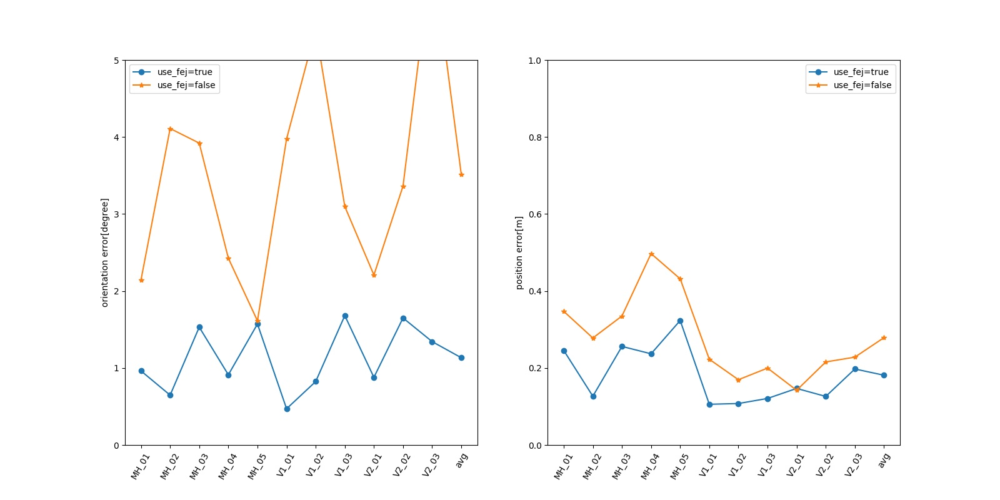

|calib_cam_intrinsics|MH_01|MH_02|MH_03|MH_04|MH_05|V1_01|V1_02|V1_03|V2_01|V2_02|V2_03|avg|
|--|--|--|--|--|--|--|--|--|--|--|--|--|
|true|0.96,0.25|0.65,0.13|1.53,0.26|0.91,0.24|1.57,0.32|0.47,0.11|0.82,0.11|1.68,0.12|0.88,0.15|1.65,0.13|1.34,0.20|1.13,0.18|
|false|1.00,0.30|0.42,0.15|1.75,0.24|0.99,0.22|1.50,0.50|0.67,0.10|0.62,0.13|1.32,0.13|1.48,0.15|1.63,0.14|1.04,0.23|1.13,0.21|

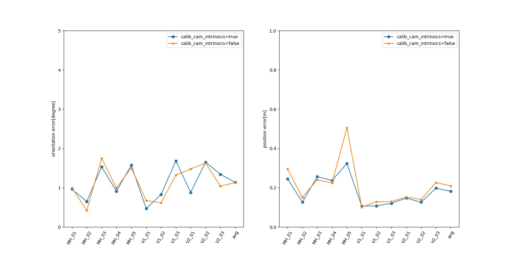

|calib_cam_extrinsics|MH_01|MH_02|MH_03|MH_04|MH_05|V1_01|V1_02|V1_03|V2_01|V2_02|V2_03|avg|
|--|--|--|--|--|--|--|--|--|--|--|--|--|
|true|0.96,0.25|0.65,0.13|1.53,0.26|0.91,0.24|1.57,0.32|0.47,0.11|0.82,0.11|1.68,0.12|0.88,0.15|1.65,0.13|1.34,0.20|1.13,0.18|
|false|1.18,0.28|0.78,0.17|1.50,0.21|1.74,0.33|1.29,0.40|0.55,0.10|0.93,0.11|1.46,0.15|1.10,0.13|1.09,0.13|1.24,0.28|1.17,0.21|

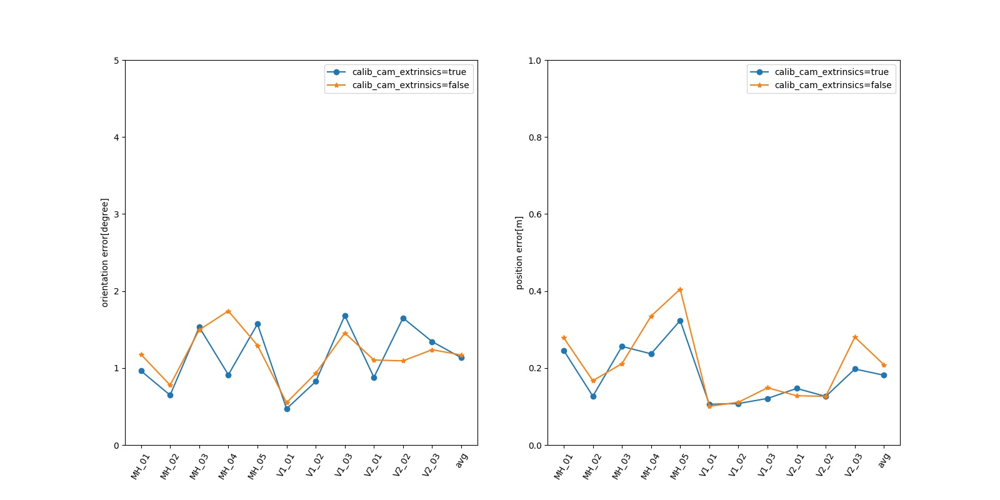

|calib_cam_timeoffset|MH_01|MH_02|MH_03|MH_04|MH_05|V1_01|V1_02|V1_03|V2_01|V2_02|V2_03|avg|
|--|--|--|--|--|--|--|--|--|--|--|--|--|
|true|0.96,0.25|0.65,0.13|1.53,0.26|0.91,0.24|1.57,0.32|0.47,0.11|0.82,0.11|1.68,0.12|0.88,0.15|1.65,0.13|1.34,0.20|1.13,0.18|
|false|1.06,0.22|1.01,0.13|1.67,0.18|0.91,0.23|1.49,0.36|0.48,0.12|0.79,0.12|1.55,0.14|0.66,0.15|1.91,0.10|1.39,0.23|1.17,0.18|

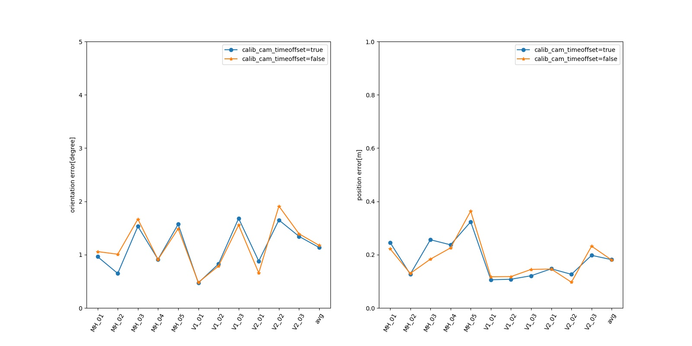

|max_clones|MH_01|MH_02|MH_03|MH_04|MH_05|V1_01|V1_02|V1_03|V2_01|V2_02|V2_03|avg|
|--|--|--|--|--|--|--|--|--|--|--|--|--|
|11|0.96,0.25|0.65,0.13|1.53,0.26|0.91,0.24|1.57,0.32|0.47,0.11|0.82,0.11|1.68,0.12|0.88,0.15|1.65,0.13|1.34,0.20|1.13,0.18|
|5|1.09,0.43|0.60,0.16|1.04,0.21|1.33,0.21|2.51,0.45|0.62,0.09|0.78,0.15|1.95,0.15|3.61,58.03|2.40,0.12|1.97,0.20|1.63,5.47|
|10|0.89,0.21|0.51,0.11|2.32,0.23|1.43,0.24|2.38,0.39|0.57,0.11|1.25,0.11|1.24,0.11|0.71,0.21|1.74,0.13|0.99,0.20|1.27,0.18|
|20|1.05,0.26|0.74,0.18|1.71,0.24|0.64,0.15|1.08,0.42|0.71,0.11|0.57,0.12|1.52,0.24|0.70,0.12|1.56,0.11|1.07,0.21|1.03,0.20|
|30|0.90,0.23|0.42,0.13|1.64,0.24|0.85,0.12|1.38,0.48|0.45,0.06|0.71,0.13|0.83,0.14|1.01,0.21|2.09,0.08|1.18,0.30|1.04,0.19|

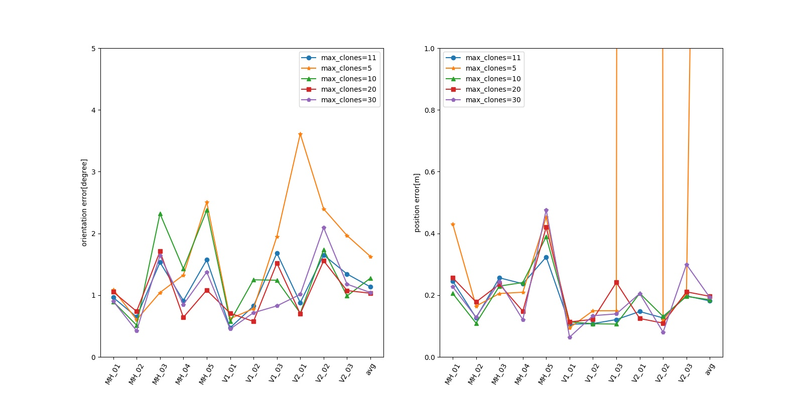

|max_slam|MH_01|MH_02|MH_03|MH_04|MH_05|V1_01|V1_02|V1_03|V2_01|V2_02|V2_03|avg|
|--|--|--|--|--|--|--|--|--|--|--|--|--|
|50|0.96,0.25|0.65,0.13|1.53,0.26|0.91,0.24|1.57,0.32|0.47,0.11|0.82,0.11|1.68,0.12|0.88,0.15|1.65,0.13|1.34,0.20|1.13,0.18|
|0|5.35,1188.32|3.27,241.87|3.96,6.34|1.95,4.04|0.54,0.82|0.79,0.15|0.84,0.24|1.45,0.16|1.82,0.21|1.19,0.14|1.33,0.20|2.05,131.14|
|20|1.14,0.31|0.57,0.16|2.44,0.28|1.04,0.22|1.37,0.43|0.65,0.12|0.93,0.17|1.63,0.13|0.74,0.20|1.07,0.15|2.60,0.26|1.29,0.22|
|100|1.05,0.20|0.48,0.17|1.67,0.24|1.09,0.18|1.54,0.39|0.42,0.12|0.90,0.10|1.23,0.11|0.71,0.16|1.84,0.11|1.30,0.21|1.11,0.18|
|200|1.01,0.28|0.57,0.17|1.75,0.20|0.83,0.18|1.05,0.43|0.44,0.11|0.68,0.12|1.04,0.11|0.86,0.18|1.99,0.10|1.13,0.22|1.03,0.19|

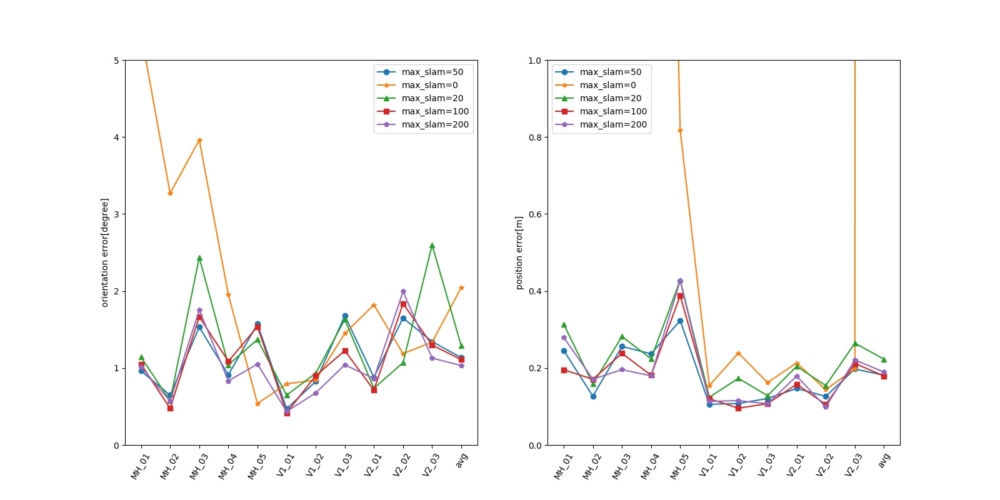

|feat_representation|MH_01|MH_02|MH_03|MH_04|MH_05|V1_01|V1_02|V1_03|V2_01|V2_02|V2_03|avg|
|--|--|--|--|--|--|--|--|--|--|--|--|--|
|GLOBAL_3D|0.96,0.25|0.65,0.13|1.53,0.26|0.91,0.24|1.57,0.32|0.47,0.11|0.82,0.11|1.68,0.12|0.88,0.15|1.65,0.13|1.34,0.20|1.13,0.18|
|GLOBAL_FULL_INVERSE_DEPTH|1.03,0.20|0.70,0.11|1.68,0.18|0.89,0.26|1.41,0.40|0.43,0.10|0.87,0.11|1.36,0.14|0.63,0.16|1.49,0.14|1.51,0.23|1.09,0.19|
|ANCHORED_3D|1.29,0.40|0.66,0.17|1.70,0.23|1.07,0.26|1.82,0.36|1.38,0.12|0.82,0.13|0.80,0.16|0.69,0.15|1.45,0.18|1.13,0.21|1.16,0.22|
|ANCHORED_FULL_INVERSE_DEPTH|1.17,0.27|1.00,0.20|2.04,0.23|1.31,0.23|1.58,0.47|0.61,0.11|0.73,0.12|1.35,0.13|0.64,0.14|1.76,0.10|1.18,0.21|1.21,0.20|
|ANCHORED_MSCKF_INVERSE_DEPTH|1.12,0.28|0.66,0.22|1.70,0.24|1.12,0.24|1.97,0.41|0.39,0.10|0.66,0.11|0.95,0.13|0.70,0.14|1.58,0.12|1.03,0.19|1.08,0.20|

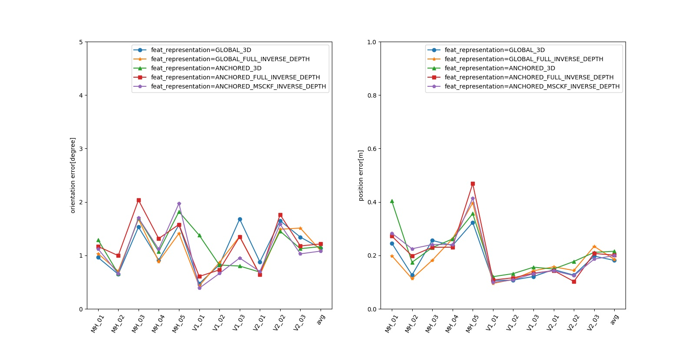

### 1.2 Stereo Version
|use_fej|MH_01|MH_02|MH_03|MH_04|MH_05|V1_01|V1_02|V1_03|V2_01|V2_02|V2_03|avg|
|--|--|--|--|--|--|--|--|--|--|--|--|--|
|true|0.97,0.15|0.47,0.10|1.02,0.28|0.88,0.17|1.22,0.26|1.02,0.07|1.16,0.26|1.75,0.08|0.73,0.11|2.75,0.09|1.60,0.14|1.23,0.16|
|false|1.84,0.21|2.09,0.24|1.42,0.18|4.40,0.72|4.12,0.60|2.45,0.13|2.89,0.31|1.76,0.08|1.30,0.13|2.19,0.13|7.67,0.30|2.92,0.28|

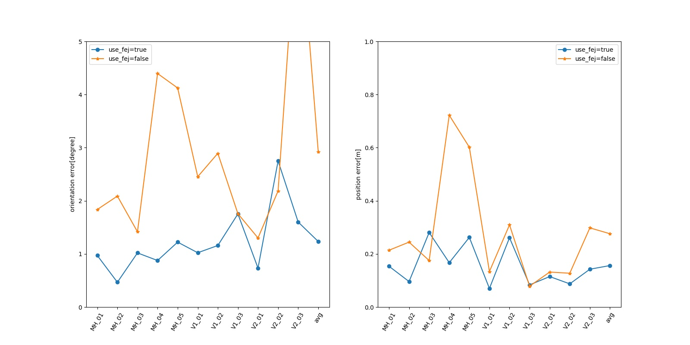

|calib_cam_intrinsics|MH_01|MH_02|MH_03|MH_04|MH_05|V1_01|V1_02|V1_03|V2_01|V2_02|V2_03|avg|
|--|--|--|--|--|--|--|--|--|--|--|--|--|
|true|0.97,0.15|0.47,0.10|1.02,0.28|0.88,0.17|1.22,0.26|1.02,0.07|1.16,0.26|1.75,0.08|0.73,0.11|2.75,0.09|1.60,0.14|1.23,0.16|
|false|1.01,0.18|0.58,0.13|0.94,0.19|0.65,0.17|1.31,0.20|1.17,0.07|1.78,0.77|1.31,0.06|0.61,0.06|2.26,0.08|1.34,0.14|1.18,0.19|

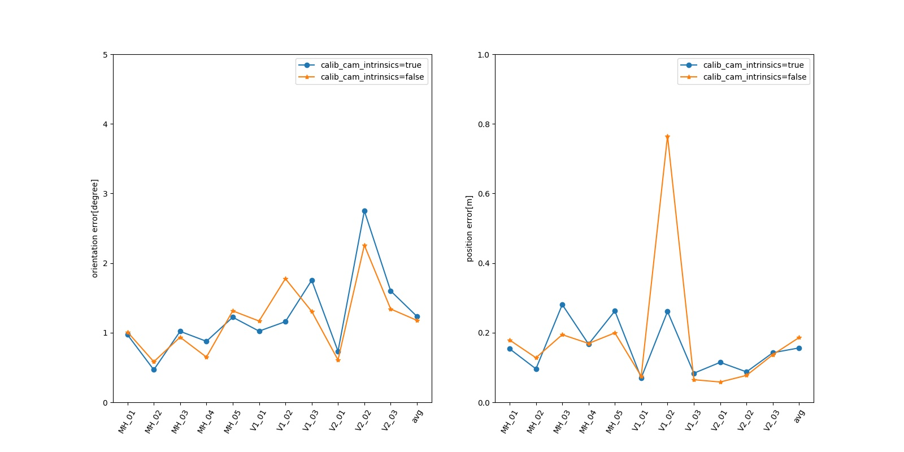

|calib_cam_extrinsics|MH_01|MH_02|MH_03|MH_04|MH_05|V1_01|V1_02|V1_03|V2_01|V2_02|V2_03|avg|
|--|--|--|--|--|--|--|--|--|--|--|--|--|
|true|0.97,0.15|0.47,0.10|1.02,0.28|0.88,0.17|1.22,0.26|1.02,0.07|1.16,0.26|1.75,0.08|0.73,0.11|2.75,0.09|1.60,0.14|1.23,0.16|
|false|1.21,0.15|0.71,0.12|1.43,0.26|1.62,0.25|0.80,0.22|0.86,0.06|59.24,3432.22|2.29,0.08|0.79,0.06|1.89,0.08|1.77,0.13|6.60,312.15|

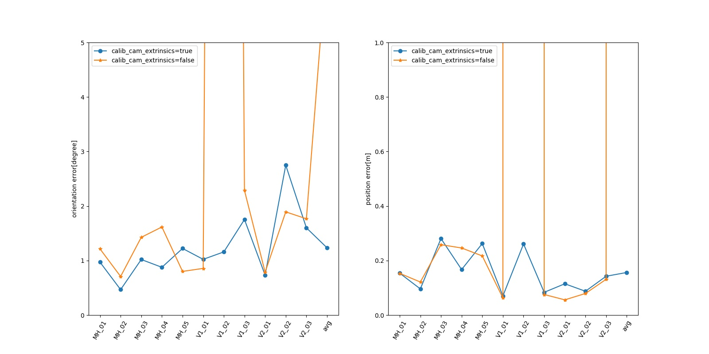

|calib_cam_timeoffset|MH_01|MH_02|MH_03|MH_04|MH_05|V1_01|V1_02|V1_03|V2_01|V2_02|V2_03|avg|
|--|--|--|--|--|--|--|--|--|--|--|--|--|
|true|0.97,0.15|0.47,0.10|1.02,0.28|0.88,0.17|1.22,0.26|1.02,0.07|1.16,0.26|1.75,0.08|0.73,0.11|2.75,0.09|1.60,0.14|1.23,0.16|
|false|1.10,0.16|1.10,0.15|1.26,0.24|1.05,0.20|1.33,0.23|1.07,0.08|0.60,0.38|1.05,0.10|0.67,0.07|2.14,0.07|1.02,0.14|1.13,0.16|

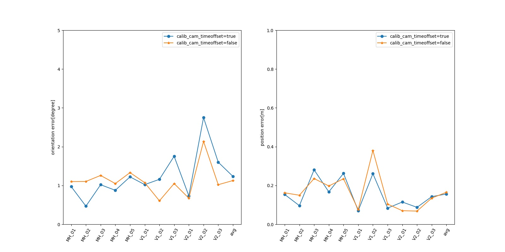

|max_clones|MH_01|MH_02|MH_03|MH_04|MH_05|V1_01|V1_02|V1_03|V2_01|V2_02|V2_03|avg|
|--|--|--|--|--|--|--|--|--|--|--|--|--|
|11|0.97,0.15|0.47,0.10|1.02,0.28|0.88,0.17|1.22,0.26|1.02,0.07|1.16,0.26|1.75,0.08|0.73,0.11|2.75,0.09|1.60,0.14|1.23,0.16|
|5|2.01,0.26|1.02,0.13|1.53,0.25|1.79,0.36|2.06,0.36|0.50,0.05|1.68,0.37|1.94,0.07|0.89,0.05|2.46,0.09|1.39,0.17|1.57,0.20|
|10|1.36,0.16|0.56,0.09|0.64,0.30|1.48,0.21|0.75,0.22|1.04,0.07|0.63,0.23|1.07,0.08|0.64,0.08|2.20,0.07|1.65,0.14|1.09,0.15|
|20|1.05,0.14|0.69,0.10|1.48,0.28|0.99,0.22|1.53,0.25|1.16,0.06|0.69,0.25|1.18,0.08|0.67,0.08|1.95,0.08|1.91,0.14|1.21,0.15|
|30|0.96,0.15|0.47,0.12|1.46,0.24|0.81,0.16|1.45,0.24|0.82,0.06|1.01,0.27|1.62,0.08|0.73,0.09|2.98,0.11|2.02,0.16|1.30,0.15|

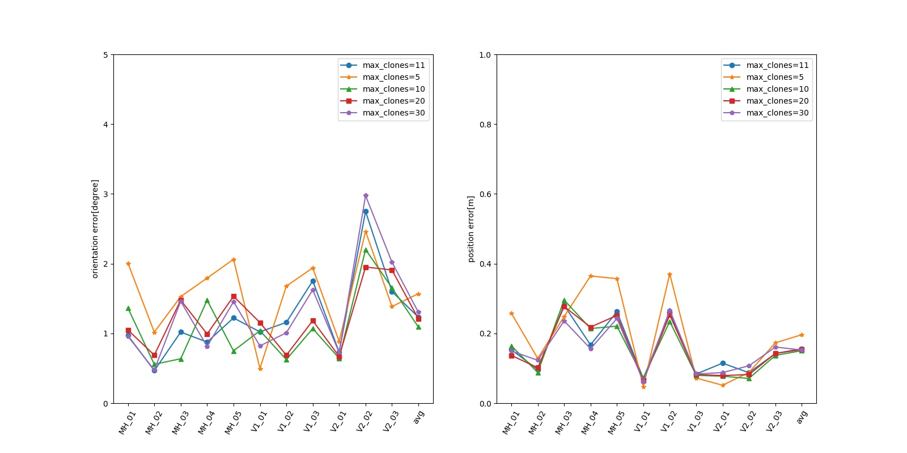

|max_slam|MH_01|MH_02|MH_03|MH_04|MH_05|V1_01|V1_02|V1_03|V2_01|V2_02|V2_03|avg|
|--|--|--|--|--|--|--|--|--|--|--|--|--|
|50|0.97,0.15|0.47,0.10|1.02,0.28|0.88,0.17|1.22,0.26|1.02,0.07|1.16,0.26|1.75,0.08|0.73,0.11|2.75,0.09|1.60,0.14|1.23,0.16|
|0|1.34,0.19|0.64,0.10|2.45,0.20|2.29,0.35|0.74,0.26|0.90,0.06|1.21,0.25|1.47,0.08|0.77,0.07|1.59,0.08|1.53,0.15|1.36,0.16|
|20|1.25,0.18|0.84,0.10|1.24,0.18|1.33,0.19|2.03,0.38|1.16,0.08|1.39,0.27|1.28,0.10|0.73,0.08|2.37,0.09|1.26,0.15|1.35,0.16|
|100|0.92,0.21|0.75,0.13|1.61,0.22|1.30,0.23|0.70,0.18|0.83,0.06|0.78,0.26|0.90,0.09|0.88,0.08|2.29,0.10|1.64,0.13|1.15,0.15|
|200|0.88,0.18|0.64,0.11|1.25,0.25|1.13,0.17|1.20,0.19|1.03,0.06|0.82,0.25|0.93,0.09|0.68,0.09|2.18,0.10|1.64,0.13|1.13,0.15|

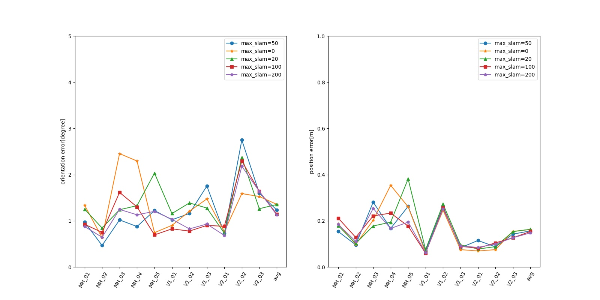

|feat_representation|MH_01|MH_02|MH_03|MH_04|MH_05|V1_01|V1_02|V1_03|V2_01|V2_02|V2_03|avg|
|--|--|--|--|--|--|--|--|--|--|--|--|--|
|GLOBAL_3D|0.97,0.15|0.47,0.10|1.02,0.28|0.88,0.17|1.22,0.26|1.02,0.07|1.16,0.26|1.75,0.08|0.73,0.11|2.75,0.09|1.60,0.14|1.23,0.16|
|GLOBAL_FULL_INVERSE_DEPTH|1.88,0.37|0.87,0.09|1.32,0.19|0.44,0.09|1.24,0.27|0.57,0.06|1.31,0.27|1.42,0.09|0.87,0.09|2.62,0.10|1.80,0.16|1.30,0.16|
|ANCHORED_3D|1.03,0.20|0.60,0.11|1.71,0.23|1.06,0.23|1.62,0.27|1.31,0.08|1.22,0.22|1.51,0.07|0.99,0.10|2.74,0.10|0.97,0.15|1.34,0.16|
|ANCHORED_FULL_INVERSE_DEPTH|1.05,0.17|0.79,0.13|1.35,0.29|0.42,0.16|1.33,0.21|0.99,0.07|0.86,0.27|2.17,0.07|0.87,0.07|2.55,0.09|1.50,0.14|1.26,0.15|
|ANCHORED_MSCKF_INVERSE_DEPTH|1.06,0.13|0.44,0.10|1.47,0.22|0.88,0.17|1.74,0.25|0.51,0.05|1.03,0.25|0.75,0.10|0.78,0.08|2.49,0.08|1.34,0.15|1.14,0.14|

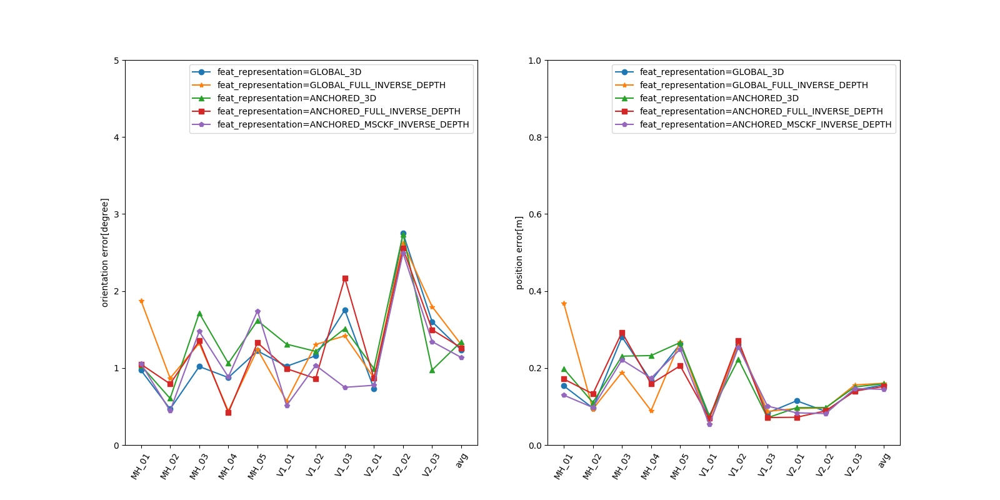

## 2. special cases comparision
We test several special cases

### 2.1 Effect from fej, calib, dt, slam
We use default param for: sliding window(11), feature representation(GLOBAL_3D).

|case|fej|intr|extr|dt|slam|MH_01|MH_02|MH_03|MH_04|MH_05|V1_01|V1_02|V1_03|V2_01|V2_02|V2_03|average|
|--|--|--|--|--|--|--|--|--|--|--|--|--|--|--|--|--|--|
|Naive|0|0|0|0|0|1.45,0.14|4.09,0.55|1.64,0.15|2.65,0.26|1.00,0.22|2.18,0.11|3.76,0.14|1.95,0.06|1.79,0.09|2.97,0.14|1.45,0.25|2.27,0.19|
|FEJ|1|0|0|0|0|1.07,0.17|0.56,0.08|2.33,0.21|0.85,0.21|0.86,0.24|0.93,0.07|1.10,0.13|0.81,0.08|2.25,0.13|1.30,0.12|1.06,0.24|1.19,0.15|
|Extrin|0|0|1|0|0|5.17,0.46|2.92,0.40|1.54,0.20|3.61,0.38|0.97,0.25|0.68,0.07|6.45,0.83|1.89,0.06|3.97,0.17|3.63,0.13|1.47,0.19|2.94,0.28|
|Extrin+Intrin|0|1|1|0|0|5.07,0.54|2.77,0.41|1.84,0.21|2.83,0.39|6.67,0.76|3.19,0.14|29.81,1651.66|2.27,0.06|4.78,0.20|8.12,0.27|2.63,0.20|6.36,150.44|
|Extrin+Intrin+camdt|0|1|1|1|0|4.15,0.41|0.48,0.16|2.38,0.20|1.86,0.33|4.42,0.54|1.83,0.11|2.65,0.75|3.39,0.07|5.25,0.21|4.61,0.15|3.78,0.19|3.16,0.28|
|SLAM|0|0|0|0|50|2.23,0.16|1.46,0.46|3.79,0.21|1.86,0.49|1.12,0.33|0.90,0.10|2.75,0.12|3.40,0.16|1.04,0.08|4.20,0.20|6.66,0.27|2.67,0.23|
|All Open|1|1|1|1|50|0.97,0.15|0.47,0.10|1.02,0.28|0.88,0.17|1.22,0.26|1.02,0.07|1.16,0.26|1.75,0.08|0.73,0.11|2.75,0.09|1.60,0.14|1.23,0.16|
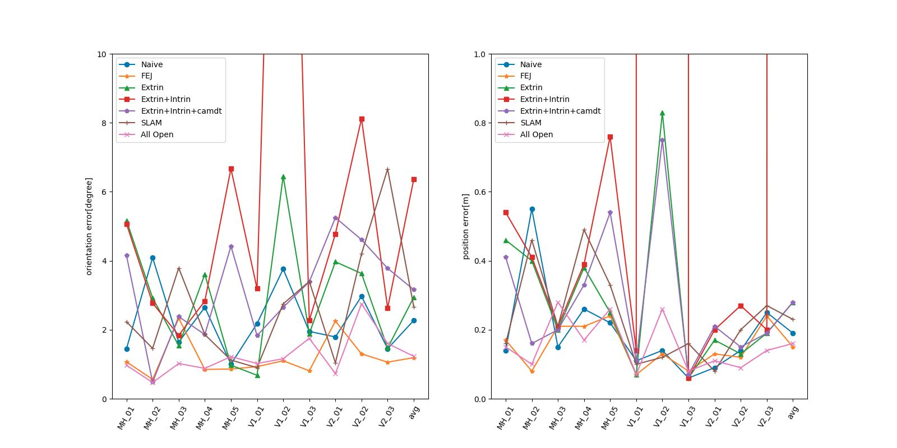

## 3. Conclusion
1. FEJ gives an significant improvement of precision on both mono and stereo version, while online calibration on intrinsic, extrinsic as well as dt(cam-imu synchronization error) give no obvious improvement, because EuROC provide good calibrations on these information.
2. Precision improved along with sliding window size inreased, while calculation increased too. There is no obviouse improvement on precision when sliding window size beyond 20. We found the best sliding window size on EUROC are 20(mono), 10(stereo).
3. Precision improved along with max slam points inreased, while calculation increased too.